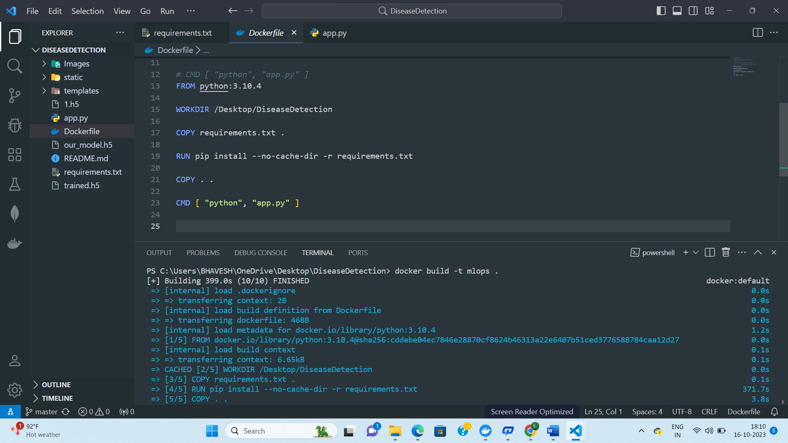
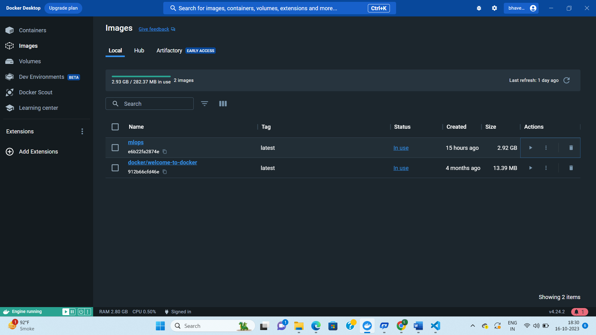
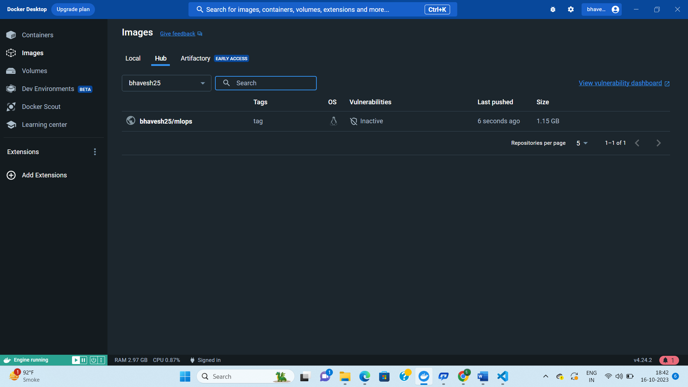

# MLops-Assignment
MLops stands for Machine learning operations is a core function of machine learning focused on taking ML models to productions and mantaining and monitoring the models.

# Docker
Docker is a Docker is a software platform that allows you to build, test, and deploy applications quickly. Docker packages software into standardized units called containers that have everything the software needs to run including libraries, system tools, code, and runtime. Using Docker, you can quickly deploy and scale applications into any environment and know your code will run.

Install Docker Desktop from https://www.docker.com/

## Docker file creation

1. Open IDE Visual Studio Code 

2. click on new file
3. Name that file as Dockerfile
4. In that file write thing mentioned below

    
## Docker Image
 - To build Docker image open terminal from the project directory where your Dockerfile is saved.
- Write command given below


```bash
  docker build -t mlops
```
- Run your Docker Image
```bash
  docker run -d mlops
```
- Check your Docker images
```bash
  docker images
```

## Push to Docker Hub

Tag your docker image

```bash
  docker tag mlops <username>/mlops:tag
```

Push to DockerHub
```bash
  docker push <username>/mlops:tag
```

