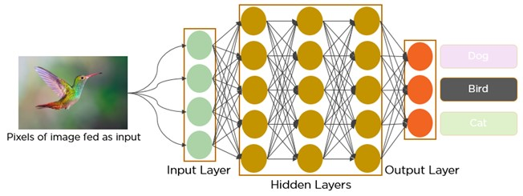
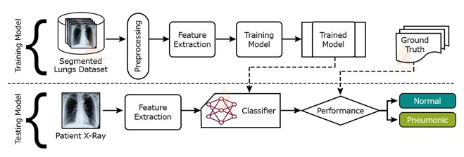
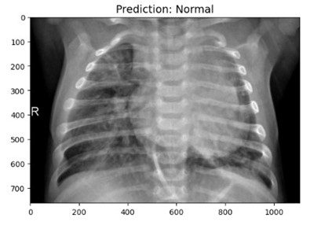
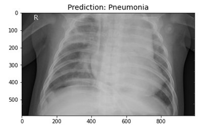
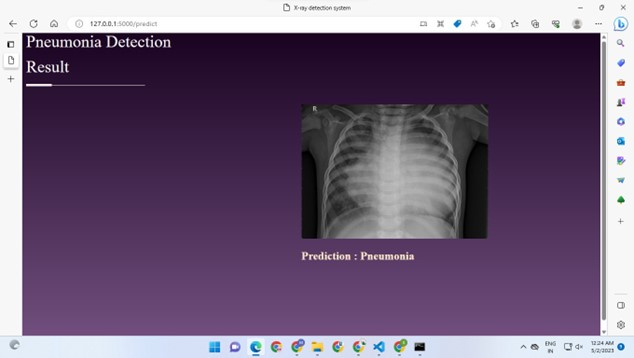

# Disease Detection System

X-ray diagnosis is a crucial task in medical imaging, where the detection and classification of various diseases can be critical for patient treatment and outcomes. Deep learning has shown significant promise in this field, as it can automatically learn complex features from medical images and achieve high accuracy in detection and classification tasks.
## 🚀 About Me
Hi my name is bhavesh Ai&Ml enthusiast who dedicated in building Machine and Deep learning model.


## 🔗 Links
[](https://www.linkedin.com/in/bhavesh-bhalerao-0958b4224?utm_source=share&utm_campaign=share_via&utm_content=profile&utm_medium=android_app)

## Roadmap

- Installing softwares

- Working with CNN

- Detection System
- Training and Testing Set
- FLask API
- UI
- Website Results

## Installation

- Make sure that Python is installed in your system or else download it from https://www.python.org/

Install Dependencies
- Install Pycharm software in your system or download it from https://www.jetbrains.com/pycharm/

```bash
  pip Install tensorflow,OpenCV-Python,Flask,Keras_preprocessing,Keras
```

## Convolutional Neural Network
A convolutional neural network (CNN or convnet) is a subset of machine learning. It is one of the various types of artificial neural networks which are used for different applications and data types. A CNN is a kind of network architecture for deep learning algorithms and is specifically used for image recognition and tasks that involve the processing of pixel data.


## Working with CNN

## Detection System

## Flask API
Flask is a micro web framework for Python that is designed to be lightweight, easy to use, and flexible. It is often used for developing web applications, APIs, and small to medium-sized web services. Flask provides the essential tools and libraries for building web applications.

## User InterFace


## Results
Normal 

Pnuemonia


## Flask API Result

## Conclusion
In conclusion, X-ray diagnosis systems play a crucial role in modern medicine, providing a safe and non-invasive way to examine the internal structures of a patient's body for the purpose of diagnosis and treatment. These systems utilize X-ray radiation to produce images of the body's internal structures, which can help healthcare professionals identify and diagnose a wide range of medical conditions, such as broken bones, lung diseases, and digestive system disorders.
## Acknowledgements
1.	U. Thiem, H. Heppner, and L. Pientka, “Elderly patients with community-acquired pneumonia,” Drugs & Aging, vol. 28, no. 7, pp. 519–537, 2011
.
2.	Y. Gupta and S. Agrawal, “A study of lung disease using image processing in big data environment,” IOP Conference Series: Materials Science and Engineering, vol. 1022, Article ID 012030, 2021.

3.	V. Sirish Kaushik, A. Nayyar, G. Kataria, and R. Jain, “Pneumonia detection using convolutional neural networks (CNNs),” Lecture Notes in Networks and Systems, pp. 471–483, 2020.

4.	M. B. Alazzam and F. Alassery, “The dynamic movement of disaster management systems based on vehicle networks and applied on the healthcare system,” Applied Bionics and Biomechanics, vol. 2021, Article ID 5710294, 8 pages, 2021.


## Features

- Accuracy
- Instant Results
- Fast and Efficient
- Cross platform


